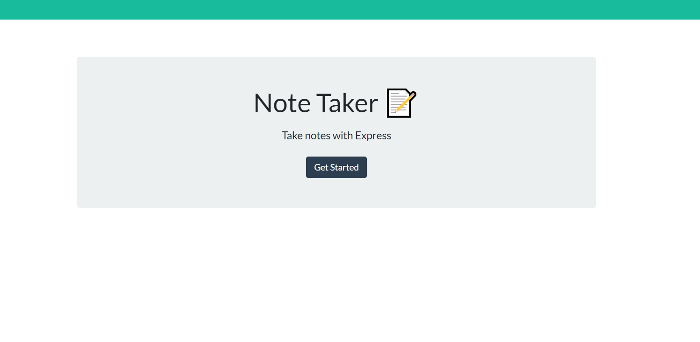
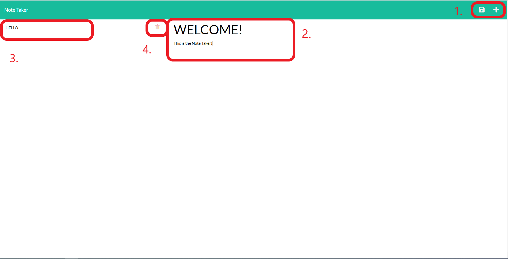

 # Express Note Taker

  [](https://opensource.org/licenses/MIT)

  ## Description

  Express Note Taker takes in user input and saves it onto a JSON file. The point of creating this was to give users the tool to record tasks they need to do. The motivation was to apply newly learned Express.js to create a server for this simple client side webpage. With the provided source code for the front end, the backend implementation consisted of routing and CRUD operations, includes POST, GET, and DELETE. The data persistence in this application uses a JSON file within the file directory to store user inputs. Finally, this helped solidify the understanding of Heroku by deploying it there. 

  ## Table of Contents

  - [Installation](#installation)
  - [Usage](#usage)
  - [Contributing](#contributing)
  - [Tests](#tests)
  - [Questions](#questions)
  - [License](#license)

  ## Installation

  Assuming you have the files cloned or saved unto your local device, in your terminal type the following to install all the necessary packages for this application:
  ```
  $ npm install
  ```
  The dependencies being used are `Express` and `Uniqid`, `Nodemon` is in the dev dependencies for testing purposes. 

  ## Usage

  With this application, You can type in tasks or notes that you want to save. Here is the landing page and a button to click to get you to the input area.

  

  <br>

  Here is the area where you can save tasks and look at saved tasks. 

  

  1. The plus button is always there if you want to clear or create a new task. The save button is visible when you type in any text in the text area, when clicked it will save it and display on the left hand side.
  2. This area will have the input box for the title and the description. 
  3. Titles of the save notes which can be clicked to display it on the right hand side. 
  4. The button to delete the saved note. 


  ## Contributing

  Please do not fork it. If you would like to contribute, clone it and do a pull request. Thank you!

  ## Tests 

  [https://notes-express-app.herokuapp.com/](https://notes-express-app.herokuapp.com/)

  ## Questions

  GitHub profile: [https://github.com/DKhubgit](https://github.com/DKhubgit)

  Email me at - Danielkang13@gmail.com - if you have questions!

  ## License

  Copyright (c) 2022 , DKhubgit
  
  All rights reserved.

  Licensed under the [MIT license](https://opensource.org/licenses/MIT) License.
  
  

